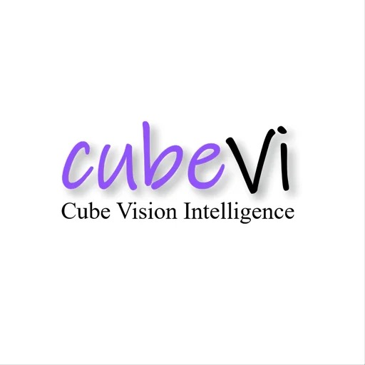
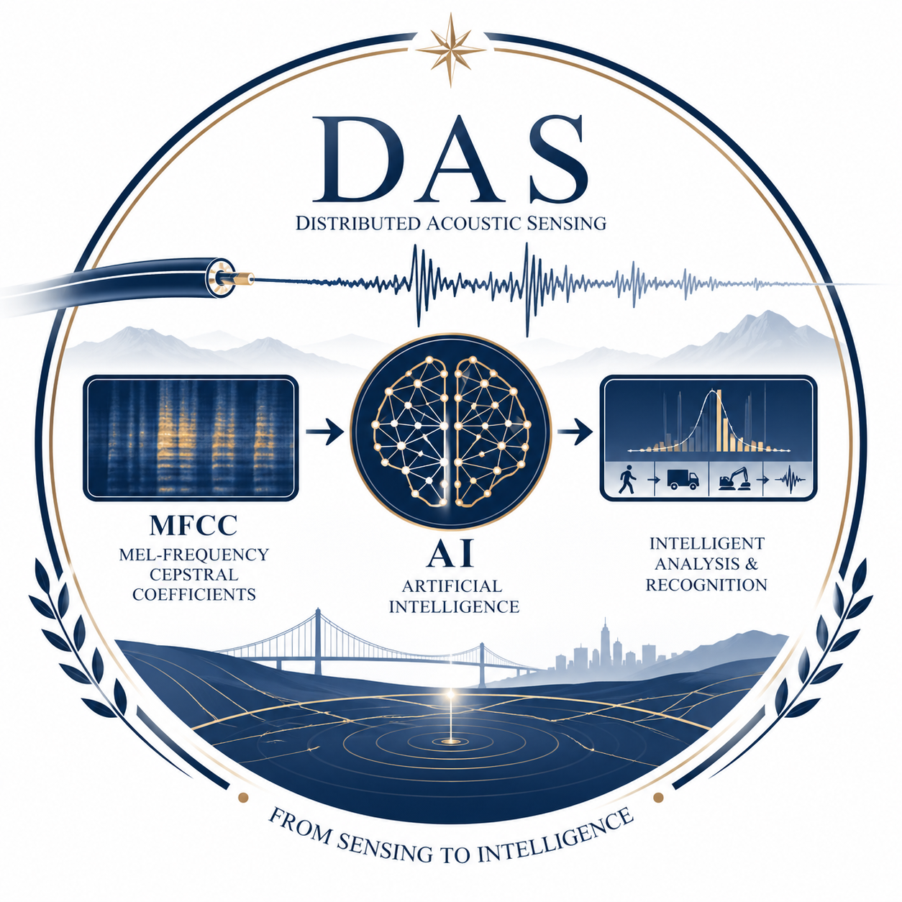
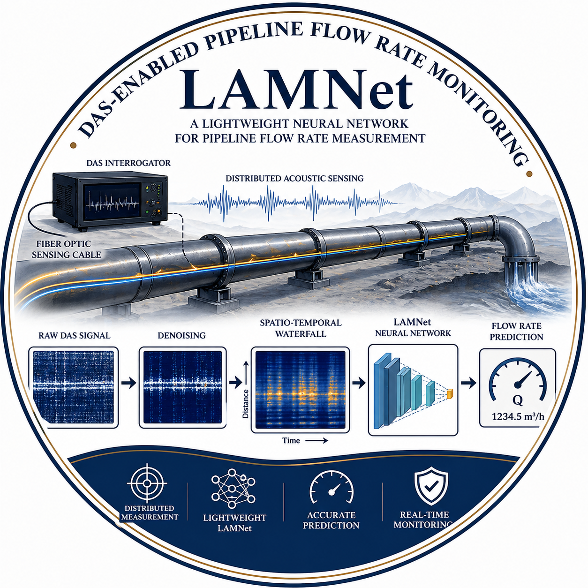

I am a third-year master’s student at the [University of Science and Technology, Beijing](https://www.ustb.edu.cn/), majoring in Communication Engineering. 

My research interests lies at the intersection of machine learning, computer vision, and computer graphics, including 3D mesh generation, digital human, and AI Agent.

<!--  -->

## News
------
* [2026.03] One paper accepted to [IEEE Transactions on Instrumentation and Measurement](https://doi.org/10.1109/TIM.2026.3682837).
* [2025.09] One paper accepted to [Measurement](https://doi.org/10.1016/j.measurement.2025.118927).

## Education Experience
------

  
  

    <strong>University of Science and Technology, Beijing (USTB)</strong> 
    <em>Master's Degree</em> &nbsp;|&nbsp; 2023 – 2026 
    Major: Communication Engineering 
  

  
  

    <strong>University of Science and Technology, Beijing (USTB)</strong> 
    <em>Bachelor's Degree</em> &nbsp;|&nbsp; 2019 – 2023 
    Major: Communication Engineering
  

## Work Experience
------

  
  

    <strong><a href="https://www.yuanjingos.com/">YuanJing, Alibaba Group</a> , Beijing, China</strong>  
    <em>3D AIGC Internship</em> &nbsp;|&nbsp; 2026.03 – present 
    <!-- Major: Communication Engineering -->
  

  
  

    <strong><a href="https://www.aitutor100.com/">AiShiWeiLai AI Research</a> , Beijing, China</strong> 
    <em>Digital Human Internship</em> &nbsp;|&nbsp; 2025.07 – 2025.12 
    <!-- Major: Communication Engineering -->
  

  
  

    <strong><a href="https://www.openstageai.com/">Cube Vision Intelligence, CubeVi</a> , Beijing, China</strong> 
    <em>AIGC Internship</em> &nbsp;|&nbsp; 2024.05 – 2025.06 
    <!-- Major: Communication Engineering  -->
  

## Publications
------

  

  

    
      <b>Performance enhancement of Φ-OTDR event classification via dynamic MFCCs and multi-scale discriminator-based FastGAN data augmentation</b>
       
     
    
      Isaack Kamanga, 
      <b>Ruiqing Tang</b>, 
      Zhi Wang,
      Guo Zhu
      Fei Liu
      Xian Zhou
       
     
    
      Measurement
       
     
    
      <a href="https://doi.org/10.1016/j.measurement.2025.118927">[paper]</a> 
      <!-- <a href="../OpenDelight/index.html">[project]</a> /
      <a href="https://github.com/yxuhan/OpenDelight">[code]</a> -->
    
  

 

  

  

    
      <b>A Lightweight Neural Network for Pipeline Flow Rate Measurement Using Distributed Acoustic Sensing</b>
       
     
    
      <b>Ruiqing Tang</b>, 
      Yi, Shi,
      Fei Liu,
      Xin Huang,
      Isaack Kamanga,
      Huayang Lv,
      tong Zhou,
      Guozhen Tan,
      Guo Zhu,
      Hao Zeng,
      Yuanyuan Li,
      Xian Zhou
       
     
    
     IEEE Transactions on Instrumentation and Measurement
       
     
    
      <a href="https://doi.org/10.1109/TIM.2026.3682837">[paper]</a> 
      <!-- <a href="../OpenDelight/index.html">[project]</a> /
      <a href="https://github.com/yxuhan/OpenDelight">[code]</a> -->
    
  

 

You can find my CV here: [Ruiqing Tang's Curriculum Vitae](../assets/RuiqingTang_CV.pdf).

[Email](mailto:tangruiqing123@gmail.com) / [Github](https://github.com/RuiqingTang) / [Wechat](../images/wechat.png) 

